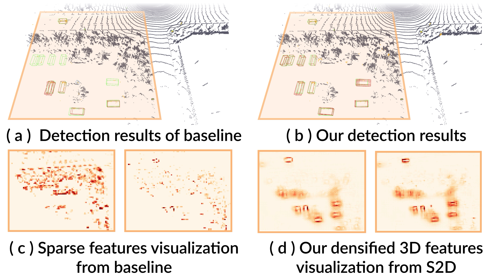

[](https://arxiv.org/abs/2211.13067)


# Sparse2Dense: Learning to Densify 3D Features for 3D Object Detection (NeurIPS 2022)


Transfer dense point knowledge from the Dense point 3D Detector (DDet) to the Sparse point 3D Detector (SDet). For more details, please refer to: 

**Sparse2Dense: Learning to Densify 3D Features for 3D Object Detection [[Paper](https://arxiv.org/abs/2211.13067)]** <br />
Tianyu Wang, Xiaowei Hu, Zhengzhe Liu, and Chi-Wing Fu<br />

<p align="center">  </p>


## Abstract
LiDAR-produced point clouds are the major source for most state-of-the-art 3D object detectors. Yet, small, distant, and incomplete objects with sparse or few points are often hard to detect. We present Sparse2Dense, a new framework to efficiently boost 3D detection performance by learning to densify point clouds in latent space. Specifically, we first train a dense point 3D detector (DDet) with a dense point cloud as input and design a sparse point 3D detector (SDet) with a regular point cloud as input. Importantly, we formulate the lightweight plug-in S2D module and the point cloud reconstruction module in SDet to densify 3D features and train SDet to produce 3D features, following the dense 3D features in DDet. So, in inference, SDet can simulate dense 3D features from regular (sparse) point cloud inputs without requiring dense inputs. We evaluate our method on the large-scale Waymo Open Dataset and the Waymo Domain Adaptation Dataset, showing its high performance and efficiency over the state of the arts.


## Use CenterPoint+S2D

### Installation

Please refer to [INSTALL](docs/INSTALL.md) to set up libraries needed for distributed training and sparse convolution.

### Benchmark Evaluation and Training 

Please refer to [GETTING_START](docs/GETTING_START.md) to prepare the data. Then follow the instruction there to reproduce our detection results. All detection configurations are included in [configs](configs).

### Dense Object Set
<p align="center">  </p>

The code of dense object generation still needs to be cleaned. So we first provide our generated version. Please send us an [email](mailto:steve.w.git@icloud.com) with your name, institute, a screenshot of the the Waymo dataset registration confirmation mail, and your intended usage. Please note that Waymo open dataset is under strict non-commercial license. For more details, please refer to [Waymo](docs/WAYMO.md). 

### TODO List
- [ ] Clean and release the code of dense object generation  

### Experimental results (Trained on 20% Waymo Open Dataset)
#### Waymo Open Dataset *Val* set
| Model    | Veh_L2 | Ped_L2 | Cyc_L2  | Overall mAPH   |
|------------|----|--------|---------|--------|
| [SECOND](configs/waymo/voxelnet/waymo_centerpoint_second_3x_interval_5.py) | 59.4 | 48.0 | 55.2 | 49.7 |  
| [SECOND+S2D](configs/waymo/voxelnet/waymo_centerpoint_second_3x_distill_interval_5.py) | **63.5** | **51.1** | **57.0** | **52.9** | 
| [CenterPoint-Pillar](configs/waymo/pp/waymo_centerpoint_pp_two_pfn_stride1_3x_distill_interval_5.py) | 64.1 | 61.1 | 59.76 | 57.9 | 
| [CenterPoint-Pillar+S2D](configs/waymo/pp/two_stage/waymo_centerpoint_pp_two_pfn_stride1_two_stage_bev_distill_interval_5) | **68.1** | **66.4** | **65.3** | **63.1** | 
| [CenterPoint](configs/waymo/voxelnet/two_stage/waymo_centerpoint_voxelnet_two_stage_interval_5.py) | 65.5 | 66.3 | 66.3 | 63.78 |
| [CenterPoint+S2D](configs/waymo/voxelnet/two_stage/waymo_centerpoint_voxelnet_two_stage_distill_interval_5.py)| **68.2** | **70.1** |  **69.3**| **66.9** |

#### Waymo Domain Adaption Dataset *Val* set


| Model  | Veh_L2 mAP | Veh_L2 mAPH |  Ped_L2 mAP | Ped_L2 mAPH   |      
|------------|----|----|----|---------|
| [SECOND](configs/waymo/voxelnet/waymo_centerpoint_second_3x_interval_5.py) | 42.9 | 41.2 | 9.8 | 8.5 | 
| [SECOND+S2D](configs/waymo/voxelnet/waymo_centerpoint_second_3x_distill_interval_5.py) | **46.3** | **45.0** |  **12.2**| **10.7**|
| [CenterPoint-Pillar](configs/waymo/pp/waymo_centerpoint_pp_two_pfn_stride1_3x_distill_interval_5.py) | 45.3 | 44.6 | 8.8 | 7.3 | 
| [CenterPoint-Pillar+S2D](configs/waymo/pp/two_stage/waymo_centerpoint_pp_two_pfn_stride1_two_stage_bev_distill_interval_5) |  **50.1** | **49.6** |  **13.3** | **11.4**|
| [CenterPoint](configs/waymo/voxelnet/two_stage/waymo_centerpoint_voxelnet_two_stage_interval_5.py) | 48.4 | 47.9 | 21.2 | 19.8 | 
| [CenterPoint+S2D](configs/waymo/voxelnet/two_stage/waymo_centerpoint_voxelnet_two_stage_distill_interval_5.py) | **51.0** | **50.4** |  **26.0**| **24.7**|

## Bibtex
```
@inproceedings{wang2022sparse2dense,
  title={{Sparse2Dense}: Learning to Densify 3D Features for 3D Object Detection},
  author={Wang, Tianyu and Hu, Xiaowei and Liu, Zhengzje and Fu, Chi-Wing},
  booktitle=NIPS,
  year={2022},
}
```

## License

Sparse2Dense is release under MIT license (see [LICENSE](LICENSE)). It is developed based on a forked version of [CenterPoint](https://github.com/tianweiy/CenterPoint/tree/5b0e574a4478086ee9686702456aaca4f4115caa) and [det3d](https://github.com/tianweiy/CenterPoint/tree/5b0e574a4478086ee9686702456aaca4f4115caa).  See the [NOTICE](docs/NOTICE) for details. Note that Waymo datasets are under non-commercial licenses. 


## Contact
Any questions or suggestions are welcome! 

Tianyu Wang [steve.w.git@icloud.com](mailto:steve.w.vision@git.com) 

## Acknowlegement
This project is not possible without multiple great opensourced codebases. We list some notable examples below.  

* [CenterPoint](https://github.com/tianweiy/CenterPoint)
* [det3d](https://github.com/poodarchu/det3d)
* [second.pytorch](https://github.com/traveller59/second.pytorch)
* [CenterTrack](https://github.com/xingyizhou/CenterTrack)
* [CenterNet](https://github.com/xingyizhou/CenterNet) 
* [mmcv](https://github.com/open-mmlab/mmcv)
* [mmdetection](https://github.com/open-mmlab/mmdetection)
* [OpenPCDet](https://github.com/open-mmlab/OpenPCDet)

## Third-party resources

- [ONCE_Benchmark](https://github.com/PointsCoder/ONCE_Benchmark): Implementation of CenterPoint on the ONCE dataset 
- [CenterPoint-KITTI](https://github.com/tianweiy/CenterPoint-KITTI): Reimplementation of CenterPoint on the KITTI dataset 
- [AFDet](https://arxiv.org/abs/2006.12671): another work inspired by CenterNet achieves good performance on KITTI/Waymo dataset. 
- [mmdetection3d](https://github.com/open-mmlab/mmdetection3d/tree/master/configs/centerpoint): CenterPoint in mmdet framework. 